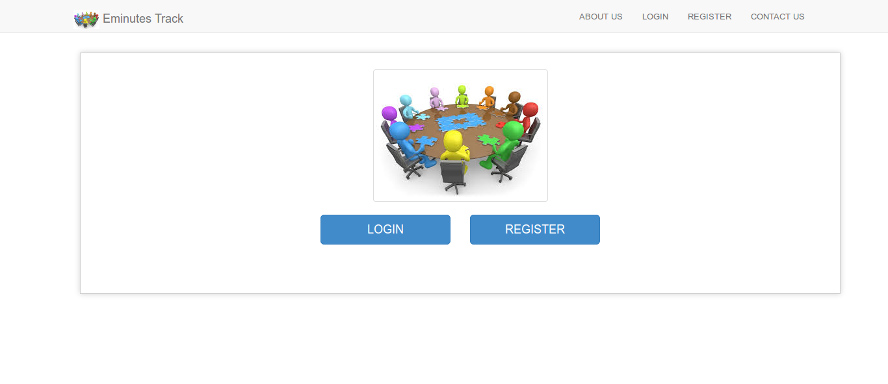
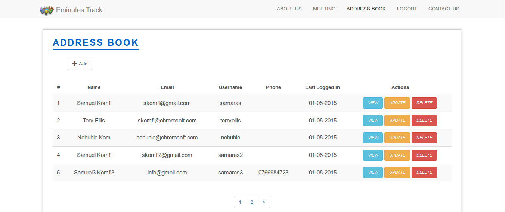
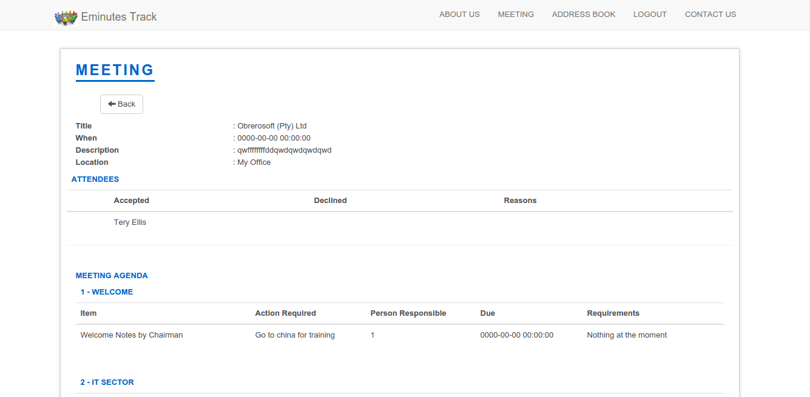
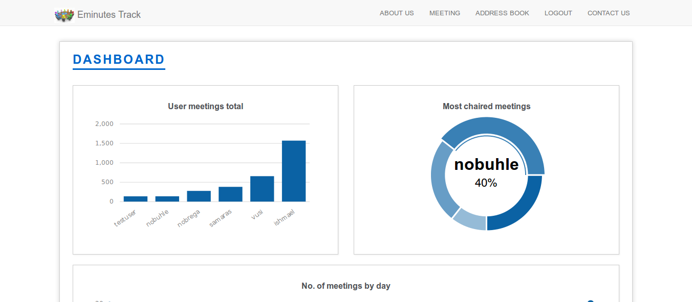
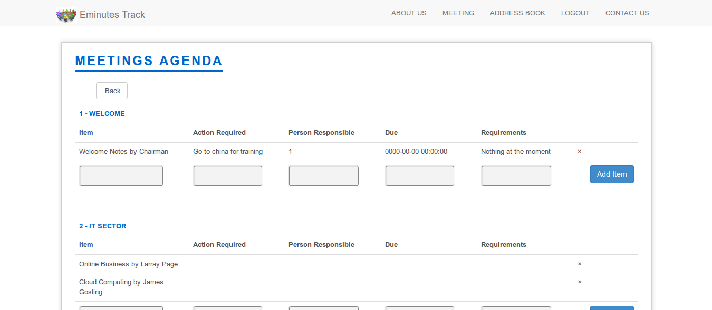

## eminutes
Minutes taking micro application in Codeigniter

## Requirements

* PHP
* MySQL

## Features
* Built using CodeIgniter 3
* Create minutes and invite participant
* Using Authex library for user authentication

    

 

    

 

    

 

    

 

    

## License
See [LICENSE](LICENSE) for details.
